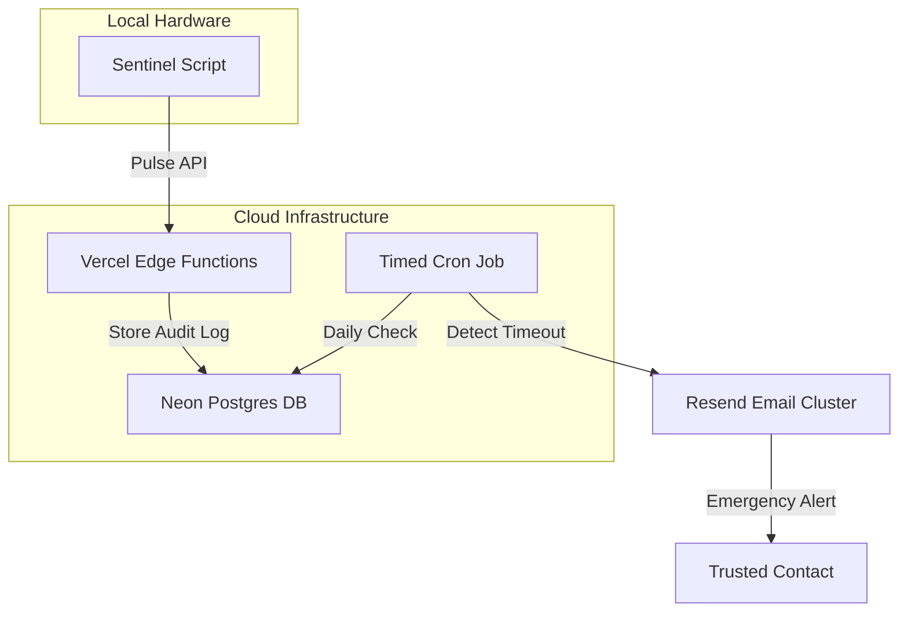

# 🛡️ GuardianSwitch

### **The Intelligent Dead Man's Switch for Digital Continuity**

---

## 🎯 The Problem
In an era where our lives are increasingly digital, we often hold keys to vaults, servers, and sensitive accounts that only we can access. But what happens if you suddenly become unavailable? 

**GuardianSwitch** solves the problem of **"Digital Legacy & Continuity"**. It is a fail-safe system designed to monitor your activity and automatically notify trusted contacts with critical information if you stop checking in for a specified period.

## 🚀 Key Features

- **🔐 Multi-User Security**: Full authentication system with encrypted sessions and bcrypt-hashed security.
- **🖥️ Cross-Platform Sentinels**: One-click background service installers for **Windows (PowerShell)** and **Linux (Systemd/Bash)**.
- **⚡ Autonomous Heartbeats**: Ultra-lightweight Python sentinels that send encrypted pulses from your local hardware.
- **📱 Premium OLED UI**: A high-fidelity dashboard with real-time status tracking and pulse history logs.
- **🛠️ Zero-Dev Setup**: Non-technical users can configure emergency messages and intervals directly via the web UI.
- **📧 Reliable Escalation**: Automated email triggers powered by Resend for guaranteed delivery of emergency protocols.

---

## 🏗️ System Architecture

---

## 💻 Technical Stack

- **Frontend**: Next.js 15 (App Router), Tailwind CSS, Lucide Icons.
- **Backend": Next.js Server Actions & Edge API Routes.
- **Database**: Neon Serverless Postgres.
- **ORM**: Drizzle ORM.
- **Security**: JWT-based session management & BcryptJS.
- **Notifications**: Resend.

---

## 🛠️ Installation & Setup

### **For Users (Strangers)**
1. **Initialize**: Create an account at [guardian-switch-jf1r.vercel.app](https://guardian-switch-jf1r.vercel.app/register).
2. **Configure**: Enter your trusted contact's email and your emergency data in the dashboard settings.
3. **Deploy**: Copy the "One-Click Installation" command for your OS (Windows or Linux) and run it in your terminal.
4. **Active Check**: Your sentinel will now run silently in the background every hour.

### **For Developers (Self-Hosting)**
1. **Clone**: `git clone https://github.com/SwiftTim/guardian-switch.git`
2. **Install**: `npm install` (in both `backend` and `client` if applicable).
3. **Connect**: Set up your `.env.local` with your Neon `DATABASE_URL` and `RESEND_API_KEY`.
4. **Launch**: `npm run dev`

---

## 📦 API Protocols

Endpoints are secured via Bearer Token (API Keys).

| Endpoint | Method | Description |
| :--- | :--- | :--- |
| `/api/pulse` | POST | Accept heartbeats from local sentinels |
| `/api/monitor/update` | POST | Update user-defined emergency parameters |
| `/api/cron/check-monitors`| GET | Trigger the global silence verification cycle |

---

## 🌌 The Niche
GuardianSwitch is built for:
- **Solo Developers**: Pass on SSH keys and repo access to partners.
- **Crypto Asset Holders**: Ensure seed phrases reach loved ones.
- **Human Rights Defenders**: Trigger data wipe or notification protocols in high-risk zones.
- **Anyone** who wants to ensure their digital footprint doesn't die with them.

---

### **Live Platform:** [https://guardian-switch-jf1r.vercel.app/](https://guardian-switch-jf1r.vercel.app/)

*Built with ❤️ for the protection of digital legacies.*
